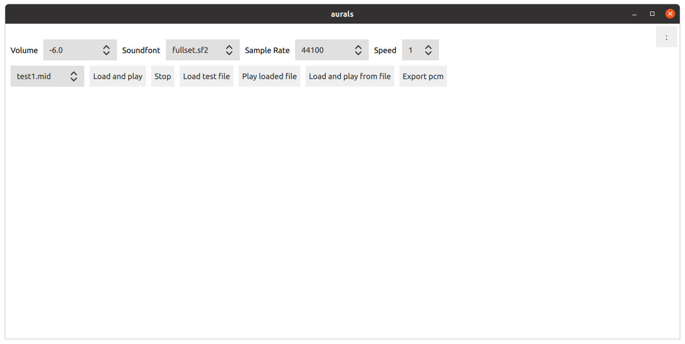

# mtherapp
Engine for music and voice applications, including music therapy

This application was developed with Qt 5.15.2 using QML. Tested on linux/android/windows.

Current status is pre-alpha, no releases yet.

## Features

* Audio recording, audio playing (from file or recorder)
* MIDI files loading, saving, generating (several effects functions migrated from guitar tablatures)
* Audio generation from MIDI files using soundfonts
* Feature extration: root mean square, F0, F0 to midi, mean, median, mode, range, peaks finder
* Audio qml component, to explore sound using root mean square, with start\end note peaks finder and F0
* Spectrograph component using fast fourier transform with various parameters
* Possible noise detection in fft window (yet very plain)
* Tapping componet, to tap rhythm using mouse\mobile device screen with export to midi\pcm
* QML logger component - to read logs on mobile screen (or without running application from command line)

Application contains several soundfonts and midi files to check functionality,
Implemented test to detect MIDI files regression.

## Screenshots

Wave view and spectrograph:

Wave view claps start end detection (blue is start, red is end):

Wave view with f0 diplay (red line below)

Short time fourier transform:

Constant-Q transform:

Autocorelation and Yin visualization:

Filters comparison visualization (yet only low and high pass + both):

Cepstrum visualization:

Most of the visualization could be saved as image.

To access all types of audio analysis there is a simple recorder:

There is midi player based on sound fonts:

There is tapping function, that lets you tap rhythm on screen, and save it to pcm or midi:

And there is tablature editor\viewer, yet in development:

## Libraries

Project uses 2 libraries:

* TinySoundFont

https://github.com/schellingb/TinySoundFont

* FFTReal (tiny tweaked)

https://github.com/cyrilcode/fft-real

* KISS fft

https://github.com/mborgerding/kissfft

* Constant-Q Library (tweaked for float samples)

https://code.soundsoftware.ac.uk/projects/constant-q-cpp

* DSP IIR realtime filter library

https://github.com/berndporr/iir1

* Wavelib - wavelet library (currently turned of, but library is in the repo)

https://github.com/rafat/wavelib

All libraries have permissive license, that help use same license for this project.